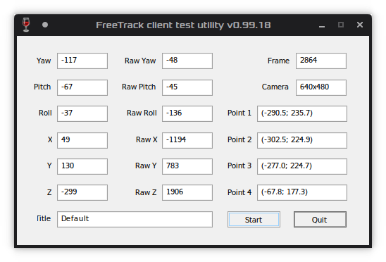

# DCS on Linux

DCS World can run on linux through Wine and Proton, though it does take some
work to get running. The game has two distribution methods: standalone and
Steam. Both have worked successfully, though often one will be broken and the
other work; if one fails, it can be a good idea to try the other.

The game also has two versions: stable and OpenBeta. OpenBeta is used
by most MP servers, and stable is updated less frequently (the advantage of
stable for us being that we don't have to work around Linux bugs every 2 weeks
when a new OB is released.)

Thanks to everyone who has helped getting the game running and debugging issues
in the [proton issue
tracker](https://github.com/ValveSoftware/Proton/issues/1722). Unfortunately,
workarounds easily get buried there, so I decided to create this document with
known, up-to-date methods for getting things to work.

Outside the proton thread, additional credit goes to @akp for the initial revision
of the Opentrack instructions, and @bradley-r for the Linuxtrack, Scratchpad and V4L2 info.

## Contents

   * [Installation](#installation)
      * [Lutris](#getting-it-working-through-lutris)
      * [Manual](#getting-it-working-manually)
   * [Bugs and Fixes](#known-issues-and-fixes)
      * [Smoke](#white-smoke-and-some-other-particles-renders-weirdly)
      * [F16 RWR](#f16-rwr-shows-a-opaque-square-on-the-rwr-over-the-priority-contact)
      * [Server List](#missing-multiplayer-server-list)
      * [F10 Crash](#crash-on-f10)
      * [Disabled Modules](#module-disabled-by-user)
      * [Controls](#control-issues)
   * [Additional Software](#other-software)
      * [SRS](#srs)
      * [Scratchpad](#dcs-scratchpad)
      * [Opentrack](#headtracking-via-opentrack)
      * [Linuxtrack](#headtracking-via-linuxtrack)
      * [V4L2](#a-note-on-headtracking)

## Installation

### Getting it working through Lutris

An easy way to get started is to use Lutris. There are [two install scripts
for standalone](https://lutris.net/games/dcs-world/) on Lutris which may just work out of the box.
Much of this guide has been tested to work successfully with the 'Eagle Dynamics version'.

### Getting it working manually

Both versions need some winetricks applied. For standalone, use `winetricks`,
for proton use `protontricks 223750`.

Start the game once first to create the prefix, then run
```
<tricks command> vcrun2017 corefonts xact d3dcompiler_43
```

This should be all it takes to get standalone working.

#### Fixing Steam version permanent crashing

If your game crashes in the Steam version, it will permanently fail to start
after that. To fix that: remove `drive_c/windows/system32/lsteamclient.dll`
which was created in the crash, and the game should start back up fine.

#### Open Beta (updated for 2.5.6.59398)

For now, this guide assumes you use the standalone version. The steam version
may also work, but I have not tested it in a while. Currently, Wine 6.0 rc1 or
the Lutris version of that release are what work best but other wine versions
may also work.

First, some variables to avoid repetition:

- `$USERNAME`: refers to the wine user. On standalone, this is your normal
  username and on steam it is `steamuser`.
- `$INSTALL_DIR`: the location in program files where the game is installed.
  On standalone: `drive_c/Program Files/Eagle Dynamics/DCS` or `DCS World OpenBeta`. On Steam, it's
  `/home/frans/.local/share/Steam/steamapps/common/DCSWorld`
- `$CONFIG_DIR`: the place where user config stuff is stored
  `drive_c/users/$USERNAME/Saved Games/DCS<possibly openbeta>`.
- `$LOG`: the game log file `$CONFIG_DIR/Logs/dcs.log`.

For standalone, if the game crashes before showing the login screen, you need
to add a "DLL override" for `wbemprox`. In Lutris, you can do so under "runner
options". For Wine and Steam Proton, you can do so using the `WINEDLLOVERRIDES`
flag: https://wiki.winehq.org/Wine_User's_Guide#WINEDLLOVERRIDES.3DDLL_Overrides.

With that change, you should be able to log in but once the game starts you
will see a black screen. To fix this, create a symlink from
`$INSTALL_DIR/bin/webrtc_plugin.dll` to `$INSTALL_dir/webrtc_plugin.dll`.

The game should now start.

You may also see a crash when loading a mission. This might be caused by a
Arial missing font which can not be distributed with Wine.

## Known issues and fixes

If things go wrong, the primary thing to look for is the game log
`drive_c/users/$USERNAME/Saved Games/DCS<possibly openbeta>/Logs/dcs.log`.
After crashes, the crash reporter will spam a bit about various DLLs being used
recently, and just before that, the cause of the crash should be visible.

Sometimes crashes happen before the game gets far enough to create a log file.
Then your best bet is to read the Proton output. In both Lutris and Steam, you can easily get
this by starting them from a terminal.

If you can't find an issue, or found a solution for one, please discuss it in
the [proton issue](https://github.com/ValveSoftware/Proton/issues/1722).

### White smoke and some other particles renders weirdly

This is a long standing issue, most likely related to texture loading and tesselation. 
Luckily, it is just a visual artefact that can be (largely) ignored.

### F16 RWR shows a opaque square on the RWR over the priority contact

This issue occurs because some textures fail to load for an unknown reason. The
fix is simple: open the file
`${INSTALL_DIR}/Mods/aircraft/F-16C/Cockpit/IndicationResources/RWR/indication_RWR.tga`
with an image editor (GIMP or Krita have been used successfully), then just
re-export the file. The RWR should now render correctly.

### Missing multiplayer server list

For a few 2.5.6 versions, the server browser did not work, and neither did
directly connecting to servers using connect by IP. However, there is a
workaround.

Edit `$INSTALL_DIR/MissionEditor/modules/mul_password.lua`. Find the function `onChange_btnOk` and add the
line `onlyConnect = true` to the start of the function like so.

```lua
function onChange_btnOk()  
    onlyConnect = true -- This line was added
	if onlyConnect == true then
	-- ...
end
```

Now you should be able to use the connect by IP button to join servers, but the
server list is still broken. Luckily, a server list is available if you log in
on https://www.digitalcombatsimulator.com/, and from there you can get the IP
of servers.

### Crash on F10

For many DCS versions and/or Wine versions, if you press F10  (the default
binding to bring up the map) the game will crash ("permanently" on steam, see
fixing steam permanent crashing (above) for a fix).  Luckily, the problem is with the
F10 key itself, not the map, so rebind it to something else you see fit. The
same applies for the communication menu.

### Module disabled by user

You probably won't run into this, but if you do, there is a fix.

One of your modules is missing, it is not shown in the list at the bottom of
the main menu, and you can't use it. On standalone, check if it is enabled in
the module manager. On steam however, things are a bit more tricky. If you
copied your configs between standalone and steam, module manager disabled mods
will be disabled in steam too. This information is stored in
`$CONFIG_DIR/enabled.lua` or something similar. Remove it to fix the issues.

### Control issues

Due to the various differences between distributions, issues with (HOTAS) controls can be hard to nail down,
especially when Wine is involved - adding another layer of potentional problems. Users experiencing issues with their
controllers are advised to read through [the information here](https://github.com/bradley-r/Linux-Controller-Fixes/).

## Other software

While not included in DCS, here are some resources for getting external
software often used with the game.

### SRS

[SRS](http://dcssimpleradio.com/) is used by a lot of multiplayer servers. It
too works with some tweaks.

Install the game plugin by following the instructions in the SRS readme.

*Note* As of SRS 19.0.1, this method no longer works. As a replacement, I have
a custom SRS client that *kind of* works here: https://gitlab.com/TheZoq2/srsrs.

It's easiest to run SRS in its own prefix. Create one, and then run `winetricks
dotnet452 win10` in that prefix. Now you can start `SR-ClientRadio.exe` from
the downloaded files.

Credit: https://github.com/ciribob/DCS-SimpleRadioStandalone/issues/409.

### DCS Scratchpad

For those who want to make use of the excellent [DCS-Scratchpad utility](https://github.com/rkusa/dcs-scratchpad), 
[follow the installation instructions](https://github.com/rkusa/dcs-scratchpad) as normal. 
The scratchpad should appear in game, but when typing with it's '*window*' focused, nothing will appear. 
This is a font issue - by default, DCS-Scratchpad uses `CONSOLA.TTF`, a font not installed with Wine. 
Either install it with Winetricks, or edit line 172 in `Scripts/Scratchpad/ScratchpadWindow.dlg` to 
an installed font of your choosing, such as `CALIBRI.TTF`. Text should now appear in the scratchpad window. 

### Headtracking via Opentrack

**Users of custom/Lutris/non-system Wine versions, take note: 
Due to [issues with libwine](https://github.com/opentrack/opentrack/issues/1236), Opentrack does not support prefixes using versions of Wine
different to that of the system (and thus the one Opentrack recognises), making usage of
custom/performance-enhanced Wine versions impossible alongside it. Either run DCS with your
system Wine, or try Linuxtrack instead. Proton is unaffected.**

[Opentrack](https://github.com/opentrack/opentrack) can emulate a gamepad which is read and can be mapped to the
corresponding controls in the game. This should work out of the box, simply
select `lubudev joystick receiver` as the output in opentrack.

Opentrack can work out of the box with `libevdev joystick output`, however this requires you to bind headtracking
for every aircraft (and doesn't play well with Il-2 BoX or Falcon BMS.)

A better option, then, is to enable Wine (Freetrack and NPclient) output instead of joystick axis output. This allows
the use of headtracking across all aircraft (DCS interprets the input as an actual headtracker rather than joystick), and
should play well with other titles such as IL-2 BoX and Falcon BMS.

If you are building Opentrack from the [AUR](https://aur.archlinux.org/packages/opentrack/), you can modify the PKGBUILD.
Replace line 34: `-DSDK_WINE_PREFIX=/ \` with `-DSDK_WINE=ON/ \`. *This package now seems to include Wine output by default.*

Otherwise, you can clone the source code and follow [these
instructions](https://github.com/opentrack/opentrack/wiki/Building-on-Linux).
**After you cd into the directory, run `ccmake .`, press c to configure, turn
ON SDK_WINE, c to configure and g to generate.**

DCS still requires `HeadTracker.dll` in the `bin` directory for opentrack to
function.  Download Eagle Dynamics API interface DLL (64-bit) from
http://facetracknoir.sourceforge.net/information_links/download.htm.

You must open opentrack and start tracking before you launch DCS. Be sure to
point the output to the correct wine/proton prefix. In addition, you'll need to
launch DCS with WINEESYNC=1 or WINEFSYNC=1 if you enable those in the wine
output settings.


Context: https://github.com/ValveSoftware/Proton/issues/1722#issuecomment-749061952

### Headtracking via Linuxtrack

In the case the Opentrack fails to work (as outlined above, it cannot support custom Wine versions
such as those offered by Lutris) or you wish to try an alternative, [Linuxtrack](https://github.com/uglyDwarf/linuxtrack/) 
offers similar functionality. 

Begin by installing the [universal Linux package](https://github.com/uglyDwarf/linuxtrack/wiki/universal-Linuxtrack-package).
Once complete, run `ltr-gui` and under the 'Misc' tab, select (re)install TrackIR firmware.) Linuxtrack
will attempt to complete this task for you, but, at time of writing, the TrackIR download links have changed, so
you may need to do this manually. Download the latest TrackIR firmware, install it to your default (or
temporary) prefix, then select 'Extract from unpacked'.


Navigate to the prefix you used, and select the TrackIR 5 folder under `/drive_c/Program Files (x86)/NaturalPoint/`. 
Once done, you will be prompted to install the Wine-side components; select the prefix DCS is installed under
(only standalone has been tested.) `ltr-gui` can now be closed, and provided Linuxtrack is running
(and has been configured), use the `FreeTrackTester.exe` present in the second prefix `/drive_c/Program Files 
(x86)/Linuxtrack/`. You should see the values changing, and thus controlling the view in-game.



Note that `HeadTracker.dll` need not be present as Linuxtrack replicates TrackIR directly (in the case of DCS, at least.)

### A note on headtracking

This only applies if an IR-modified camera is used as input to your headtracking program of choice, but can be very useful if 
so. Video4Linux(2) "*is a collection of device drivers and an API for supporting realtime video capture on Linux systems*" 
and thus is the utility used by Opentrack and Linuxtrack to address IR cameras - often the venerable PS3Eye. V4L2 handles the 
configuration of attached cameras, and so is the utility to use to change any settings.


For IR-modded cameras, the settings of most significance are gain, auto-exposure and (automatic) white balance. The PS3Eye, 
not having any physical controls aside from an FOV setting, can be configured using the V4L2 test utility ([`v4l-utils`](https://pkgs.org/download/v4l-utils)), 
however changes made here do not persist across reboots. Opentrack seems to have this 
utility built-in, but for Linuxtrack users or those needing to change camera settings system-wide, there is a solution:

   * Ensure `v4l-utils` is installed.
      * Video4Linux, providing core functionality for attached video devices, is available on all mainline distributions. 	
      * Find `v4l-utils` for your distribution [here](https://pkgs.org/download/v4l-utils).
   * Open the V4L2 test utility, and select the correct camera if there are multiple connected.
      * Run `qv4l2` at the command line to launch the utility.
      * If multiple cameras are connected, look in `/dev/` for `videoX` devices.
   * Configure the settings to a suitable point. Of interest here are any automatic features that may interfere with tracking.
      * Settings for an IR-modded PS3Eye are included below.
      * As a general rule, automatic gain, white balance and (possibly) exposure should be disabled.
   * Once done, return to a command line and execute `v4l2-ctl --all`. This lists all the configurable values of the camera.
      * Framerate and pixel/capture format will be listed, but these cannot be changed via this method for the PS3Eye.
   * Using this information, make a `.sh` file with a relevant name (such as `IRcamfix.sh`) with contents in the format:
      > #!/bin/bash
      > --set-ctrl=brightness=0 \
      > --set-ctrl=contrast=32 \
      > --set-ctrl=saturation=0 \
      > --set-ctrl=gain_automatic=0 \
      > --set-ctrl=gain=0 \
      > --set-ctrl=power_line_frequency=0 \
      > --set-ctrl=sharpness=0 \
      > --set-ctrl=white_balance_automatic=0
      * This accomplishes the same thing as changing these values through the GUI but allows it to be done automatically.
      * These settings have been found to work well with a PS3Eye camera, but may need adjusting depending on use conditions.
   * Save this file, mark it as executable and add it to an autorun utility such as Plasma's autostart or Lutris' pre-launch script.
      * This will apply these changes when the start condition is triggered by their respective programs.

With this done, the camera will have these changes applied automatically, allowing immediate use of headtracking without the need to preemptively tinker with a GUI before every flight.
